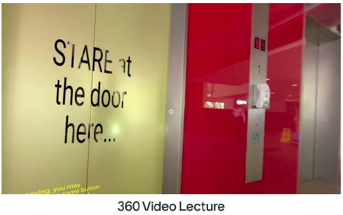
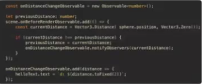

# Mentimeter

Covers from Week 8 - 10

This is an attempt to collate all mentimeter questions in one MD

## Week 8
Q1\
Which interaction mechanic is commonly deemed to be the most important in immersive AR, VR and MR experiences?
- Viewport Control
- Hand Gestures
- Body (Excluding hands gestures)
- All mechanics are equally important

  
Answer

  Viewport Control

 

This is for Q2, Q3 & Q4\

Q2\
In the VR Bioreactor Training system, what interaction mechanics were implemented?
- Viewport Control
- Hand Gestures
- Body (Excluding hands gestures)
- All of the above

  
Answer

  Viewport Control
   
  Hand Gestures

 

Q3\
In the VR Bioreactor Training system, is viewport control a passive or active interaction mechanics?
- Passive
- Active

  
Answer

  Passive

 

Q4\
In the VR Bioreactor Training system, are hand gestures a passive or active interaction mechanic?
- Passive
- Active

  
Answer

  Active

 

This is for Q5, Q6 & Q7\

Q5\
In the 360 Video Lecture, what interaction mechanics were implemented?
- Viewport Control
- Hand Gestures
- Body (Excluding hands gestures)
- All of the above

  
Answer

  Viewport Control
   
  Hand Gestures

 

Q6\
In the 360 Video Lecture, is viewport control a passive or active interaction mechanics?
- Passive
- Active

  
Answer

  Passive
   
  Active

 

Q7\
In the 360 Video Lecture, what form of interaction authenticity is the eye-gaze point-and-click mechanic?
- Natural interaction
- Artifical magical interaction
- Artifical augmented natural interaction

  
Answer

  Artifical augmented natural interaction

 

Q8\
Many users tend to route their hands behind the virtual saw blade when asked to place their hands in the target position? What is the primary reason?
- Limited field of view in the VR headset affecting depth perception
- The saw blade simply looks hyper-realistic
- High embodiment via realistic hand representation and precise tracking
- Difficult in accurately perceiving the virtual saw blade's position

  
Answer

  High embodiment via realistic hand representation and precise tracking

 

Q9\
\
What interaction authenticity is optimal?
- Natural interaction
- Artifical magical interaction
- Artifical augmented natural interaction

  
Answer

  Natural interaction

 

Q10\
\
What interaction authenticity is optimal?
- Natural interaction
- Artifical magical interaction
- Artifical augmented natural interaction

  
Answer

  Natural interaction

 

Q11\
\
Which device platform is the most appropriate here?
- Desktop
- Google Cardboard
- Meta Quest 2 (Wireless)
- HTC Vive Pro (Wired)
- Microsoft Hololens

  
Answer

  Meta Quest 2 (Wireless)

 

Q12\
\
Which device platform is the most appropriate here?
- Desktop
- Google Cardboard
- Meta Quest 2 (Wireless)
- HTC Vive Pro (Wired)
- Microsoft Hololens

  
Answer

  HTC Vive Pro (Wired)

 

Q13\
\
What form of GUI implementation is best suited for this use case?
- GUI on a virtual paper (using a virtual pen)
- GUI on a 3D plane anchored in virtual world locations
- Real-world quiz on real paper (take off HMD when interacting)

  
Answer

  GUI on a 3D plane anchored in virtual world locations
   
  Real-world quiz on real paper (take off HMD when interacting)

 

Q14\
\
What form of GUI implementation is best suited for this use case?
- GUI on a virtual paper (using a virtual pen)
- GUI on a 3D plane anchored in virtual world locations
- Real-world quiz on real paper (take off HMD when interacting)

  
Answer

  GUI on a 3D plane anchored in virtual world locations

 

Q15\
\
- Teleportation
- Joystick-based
- Walking-in-place (WIP) with KatVR 360 slidemill
- Walking-in-place (WIP) with HTC Vive HMD and trackers
- Tracking real movement in physical space

  
Answer

  Teleportation

 

Q16\
\
- Teleportation
- Joystick-based
- Walking-in-place (WIP) with KatVR 360 slidemill
- Walking-in-place (WIP) with HTC Vive HMD and trackers
- Tracking real movement in physical space

  
Answer

  Tracking real movement in physical space

 

Q17\
\
- Teleportation
- Joystick-based
- Walking-in-place (WIP) with KatVR 360 slidemill
- Walking-in-place (WIP) with HTC Vive HMD and trackers
- Tracking real movement in physical space

  
Answer

  Walking-in-place (WIP) with HTC Vive HMD and trackers

 

## Week 9
Q1\
Implement a jump action in your Babylon.js scene when the user presses the keyboard spacebar. Which trigger should you use in the ActionManager?
- OnPickTrigger
- OnInteractionEnterTrigger
- OnKeyUpTrigger
- NothingTrigger

  
Answer

  OnKeyUpTrigger

 

Q2\
\
Which implementation is the most straightforward, i.e, without reinventing the wheel?
- Behaviors
- ActionManager
- Observables

  
Answer

  ActionManager

 

Q3\
In your babylon.js, you need to periodically track changes in the position of the dog object and automatically show updates on the HUD based on its approximity to different objects.\
Which implementation is the most straightforward, i.e, without reinventing the wheel?
- Behaviors
- ActionManager
- Observables

  
Answer

  Observables

 

Q4\
\
In your babylon.js, you need to periodically track changes in the position of the dog object and automatically show updates on the HUD based on its approximity to different objects.\
Which implementation is the most straightforward, i.e, without reinventing the wheel?
- Behaviors
- ActionManager
- Observables

  
Answer

  Observables

 

Q5\
\
In your babylon.js, you need to periodically track changes in the position of the dog object and automatically show updates on the HUD based on its approximity to different objects.\
Which implementation is the most straightforward, i.e, without reinventing the wheel?
- Behaviors
- ActionManager
- Observables

  
Answer

  ActionManager

 

Q6\
\
In your babylon.js, you need to periodically track changes in the position of the dog object and automatically show updates on the HUD based on its approximity to different objects.\
Which implementation is the most straightforward, i.e, without reinventing the wheel?
- Behaviors
- ActionManager
- Observables

  
Answer

  Behaviors

 

Q7\
\
In total, how many observers were used here?
- 0
- 1
- 2
- 3
- 4
- 5

  
Answer

  2

 

Q8\
\
In total, how many observers were used here?
- 0
- 1
- 2
- 3
- 4
- 5

  
Answer

  2

 

Q9\
\
In total, how many observers were used here?
- 0
- 1
- 2
- 3
- 4
- 5

  
Answer

  1

 

Q10\
\
What is the mechanics of the following code?
- It adds an Observable to pointerDragBehavior of the sphere
- It adds an Observer to the sphere
- It adds an Observer to onDragObservable of the pointerDragBehavior
- It adds and Observable to the sphere

  
Answer

  It adds an Observer to onDragObservable of the pointerDragBehavior

 

Q11\
Which API class in Babylon.js will allow you to easily add UI controls to easily manipulate the position, rotation, and scale of meshes in your scene?\
- MultiPointerScaleBehavior
- GizmoManager
- PointerDragBehavior
- WebXRFeaturesManager

  
Answer

  GizmoManager

 

Q12\
\
What does ToTeleport do in the following Babylon.js code?\
- Sets the duration of the teleportation animation
- Sets the maximum time to complete the teleportation
- Sets the minimum delay between each teleportation trigger
- Sets the time in to hold the button before teleportation triggers

  
Answer

  Sets the time in to hold the button before teleportation triggers

 

## Week 10
Q1\
Which of the following describes immersion from a systems perspective?
- Wide FOV
- Higher spatial presence
- Teleportation feature
- High-fidelity graphics
- Lower cybersickness
- 6-DOF inside-out tracking

  
Answer

  Wide FOV
   
  Teleportation feature
   
  High-fidelity graphics
   
  6-DOF inside-out tracking

 

Q2\
**IMAGE REQUIRED**\
Which popular experiential construct(s) of immersion is/are relevant here?
- Flow
- Presence
- Cybersickness

  
Answer

  Flow
   
  Cybersickness

 

Q3\
Which of the following implementations will this design translate into?
- Constrict the FOV when moving
- Test users using the VRSQ
- Test users using the IPQ
- Create a walking-in-place location feature
- Create a teleportation locomotion feature
- Create a high-fidelity realistic 3D environment

  
Answer

  Constrict the FOV when moving
   
  Create a teleportation locomotion feature

 

Q4\
What data collection methods can be appropriate here?
- Let users fill in the IPQ
- Let users fill in the VRSQ
- Let users fill in the FSS
- Perform semi-structured interviews with users
- Create telemetry tracking mechnisms to observe users

  
Answer

  Let users fill in the VRSQ
   
  Perform semi-structured interviews with users
   
  Create telemetry tracking mechnisms to observe users

 

Q5\
**IMAGE REQUIRED**\
Which of the following implementations will this design translate into?
- Constrict the FOV when moving
- Test users using the VRSQ
- Create a zero-gravity arena that simulates physical weightlessness
- Create a walking-in-place location feature
- Create a teleportation locomotion feature
- Create a high-fidelity realistic 3D environment
- Create gamification features to guide users through the experience

  
Answer

  Create a zero-gravity arena that simulates physical weightlessness
   
  Create a high-fidelity realistic 3D environment

 

Q6\
**IMAGE REQUIRED**\
What data collection methods can be appropriate here?
- Let users fill in the IPQ
- Let users fill in the VRSQ
- Let users fill in the FSS
- Perform semi-structured interviews with users
- Create telemetry tracking mechnisms to observe users

  
Answer

  Let users fill in the IPQ
   
  Perform semi-structured interviews with users
   
  Create telemetry tracking mechnisms to observe users

 

Q7\
**IMAGE REQUIRED**\
Which of the following implementations will this design translate into?
- Create a walking-in-place location feature
- Create a teleportation locomotion feature
- Create a high-fidelity realistic 3D environment
- Create a finger-tracked hand gestures to inspect museum artifacts
- Create gamification features to guide users through the experience

  
Answer

  Create gamification features to guide users through the experience

 

Q8\
**IMAGE REQUIRED**\
What data collection methods can be appropriate here?
- Let users fill in the IPQ
- Let users fill in the VRSQ
- Let users fill in the FSS
- Perform semi-structured interviews with users
- Create telemetry tracking mechnisms to observe users

  
Answer

  Let users fill in the FSS
   
  Perform semi-structured interviews with users
   
  Create telemetry tracking mechnisms to observe users

 